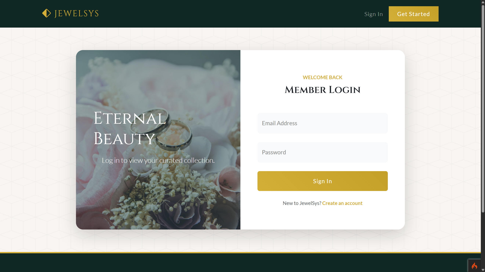

# 💍 Wedding Ring Reservation System

A web-based **Wedding Ring Reservation System** built with **PHP**, **CodeIgniter 4**, and **MySQL/MariaDB**. This application lets customers browse custom rings, make reservations, complete payments, and view receipts. Administrators can manage ring inventory, reservation status, and generate reports from a centralized system.

## 🚀 Project Overview

The application follows the **Model-View-Controller (MVC)** architecture provided by CodeIgniter 4. It supports ring browsing, reservation checkout, payment processing, customer order history, and admin management for a wedding ring store.

## 👥 User Roles

### 1. Administrator

Administrators can:

* View the admin dashboard with ring and reservation summaries.
* Manage ring inventory with create, edit, status, and delete actions.
* View and update reservation statuses.
* Review payments and mark orders as paid.
* Print reports and dashboard summaries.
* Manage profile details.

### 2. Customer

Customers can:

* Register, log in, and log out.
* Browse available wedding and engagement rings.
* View detailed ring information.
* Place reservations with size and customization notes.
* Complete reservation payments.
* View reservation history and print receipts.
* Update profile information.

## 💎 Key Features

| **Feature**                | **Description**                                                                      |
| -------------------------- | ------------------------------------------------------------------------------------ |
| **Ring Catalog**           | Browse available rings and view product details.                                     |
| **Ring Inventory**         | Admin can add, edit, update status, and remove rings from the catalog.              |
| **Reservation Checkout**   | Customers can reserve rings with size and customization options.                    |
| **Payment Management**     | Record payments and update reservation payment status.                              |
| **Reservation History**    | Customers can track past reservations and view receipts.                            |
| **Admin Reservation Tools**| Admins can review all reservations and update their status.                         |
| **Dashboard & Reporting**  | Admin dashboard displays ring and reservation summaries with printable reports.     |
| **Authentication**         | Login, registration, password hashing, and role-based access.                       |
| **Profile Management**     | Users can update their profile information.                                         |

## 🏗️ System Architecture

* **Controllers** – Application logic is handled in `app/Controllers`, with admin controllers under `app/Controllers/Admin`.
* **Models** – Data operations are managed by `app/Models`, including `RingModel`, `ReservationModel`, `PaymentModel`, and `UserModel`.
* **Views** – UI templates are stored in `app/Views`, including `customer`, `admin`, and `auth` views.
* **Routes** – URL routing is configured in `app/Config/Routes.php`.
* **Public assets** – Served from `public/`, with ring image uploads stored in `public/uploads/rings`.

## 🗄️ Database

This project uses **MySQL/MariaDB** and includes the SQL dump:

* `wedding_ring_db.sql`

Key tables include:

* `users`
* `rings`
* `reservations`
* `payments`

The SQL dump includes example admin and customer accounts, sample rings, reservations, and payment records.

## 🔐 Demo Credentials

Use the seeded accounts from the database file or register a new user.

| **Account**  | **Credentials** |
| ------------ | --------------- |
| **Admin**    | `admin@gmail.com` / seeded password from SQL |
| **Customer** | `customer@gmail.com` / seeded password from SQL |

> **Note:** If the seeded password is not available, register a new account from the login page.

## 🛠️ Technologies Used

* **PHP 8.1+**
* **CodeIgniter 4**
* **MySQL / MariaDB**
* **HTML**
* **CSS**
* **JavaScript**
* **Composer**
* **phpMyAdmin**

## 💻 How to Install & Run

### 1. Install Requirements

Before running the project, install:

* **PHP 8.1 or higher**
* **Composer**
* **MySQL / MariaDB**
* **XAMPP**, **WAMP**, or another PHP development environment

### 2. Clone the Project

```bash
git clone https://github.com/chardoxx-3/Wedding-Ring-Management-System.git
cd Wedding-Ring-Management-System
```

### 3. Install Dependencies

```bash
composer install
```

### 4. Configure the Environment

Copy the sample environment file:

```bash
copy env .env
```

Open `.env` and update your database settings:

```env
database.default.hostname = localhost
database.default.database = wedding_ring_db
database.default.username = root
database.default.password = 
database.default.DBDriver = MySQLi
database.default.port = 3306
```

Adjust the database name, username, and password for your local setup.

### 5. Create the Database

Create the database in phpMyAdmin or MySQL:

```text
wedding_ring_db
```

Import the SQL file:

```text
wedding_ring_db.sql
```

### 6. Start the Application

```bash
php spark serve
```

Open the application at:

```text
http://localhost:8080
```

### 7. Login or Register

Use the seeded admin/customer account or register a new user from the login page.

## 🔄 Application Workflow

**Login → Browse Rings → Reserve Ring → Complete Payment → View Reservation History → Admin Manage Rings/Reservations → Generate Reports**

## 🎯 Project Purpose

This project demonstrates practical skills in **web development**, **MVC architecture**, **authentication**, **CRUD operations**, **database design**, **transactional workflows**, and **admin/customer role management**.

### Login

